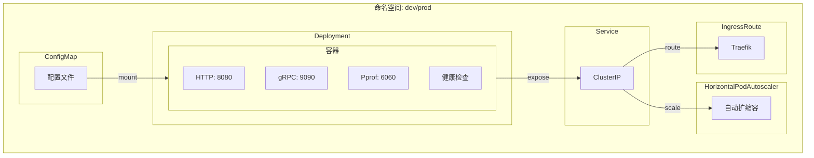
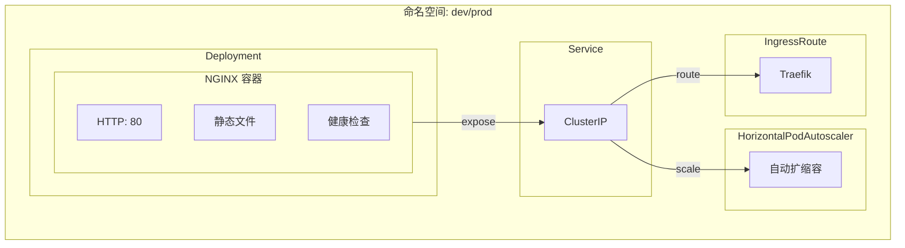
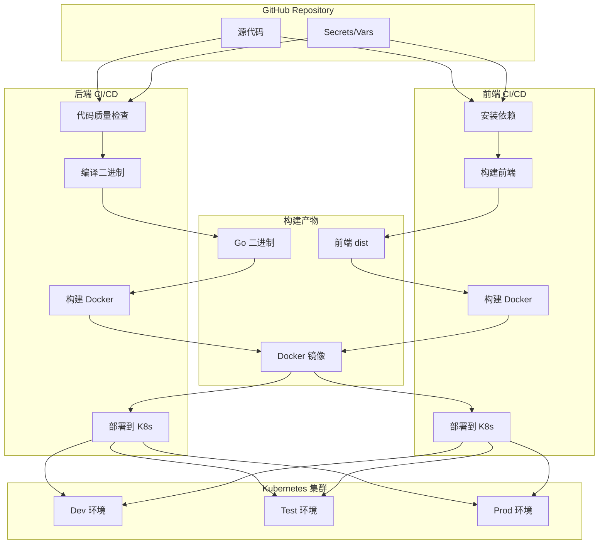

# Deploy Pipeline

可复用的 GitHub Actions 工作流集合，支持 **Go 后端服务** 和 **前端应用** 的完整 CI/CD 流程及 Kubernetes 部署

## 🏗️ 项目架构

```bash
deploy-pipeline/
├── .github/workflows/           # 可复用工作流
│   ├── code-quality.yml         # 代码质量检查
│   ├── cleanup-images.yml       # GHCR 旧镜像清理
│   ├── backend-build-binary.yml # 编译 Go 二进制文件
│   ├── backend-build-docker.yml # 构建推送后端 Docker 镜像
│   ├── backend-deploy-k8s.yml   # K8s 部署（后端服务）
│   ├── frontend-build-frontend.yml # 前端构建（支持 npm/pnpm/yarn）
│   ├── frontend-build-docker.yml   # 构建推送前端 Docker 镜像
│   └── frontend-deploy-k8s.yml     # K8s 部署（前端应用）
├── scripts/                     # 公共脚本
│   ├── backend/                 # 后端脚本
│   │   └── build-linux.sh       # Go 构建脚本
│   ├── frontend/                # 前端脚本
│   │   └── build-frontend.sh    # 前端构建脚本
│   ├── common.sh                # 通用函数库
│   └── notify.sh                # 飞书/Telegram 通知
├── templates/                   # K8s 资源模板
│   └── k8s/                     # Kubernetes 模板
│       ├── backend/             # 后端服务模板
│       │   ├── deployment.yaml  # Deployment 模板
│       │   ├── service.yaml     # Service 模板
│       │   ├── hpa.yaml         # HPA 模板
│       │   └── ingress.yaml     # IngressRoute 模板
│       └── frontend/            # 前端应用模板
│           ├── deployment.yaml  # Deployment 模板
│           ├── service.yaml     # Service 模板
│           ├── hpa.yaml         # HPA 模板
│           └── ingress.yaml     # IngressRoute 模板
└── README.md                    # 项目文档
```

## 📋 工作流列表

| 分类 | 工作流 | 文件路径 | 说明 |
|------|--------|----------|------|
| **共享** | Code Quality | `code-quality.yml` | 代码格式检查、静态分析、单元测试 |
| **共享** | Cleanup Images | `cleanup-images.yml` | 清理 GHCR 旧版本镜像 |
| **后端** | Build Binary | `backend-build-binary.yml` | 编译 Go 二进制文件（支持 UPX 压缩） |
| **后端** | Build Docker | `backend-build-docker.yml` | 构建并推送后端 Docker 镜像 |
| **后端** | Deploy K8s | `backend-deploy-k8s.yml` | 部署后端服务到 Kubernetes |
| **前端** | Build Frontend | `frontend-build-frontend.yml` | 前端构建（支持 npm/pnpm/yarn） |
| **前端** | Build Docker | `frontend-build-docker.yml` | 构建并推送前端 Docker 镜像 |
| **前端** | Deploy K8s | `frontend-deploy-k8s.yml` | 部署前端应用到 Kubernetes |

> GitHub reusable workflow 的 `uses:` 目标必须直接位于 `.github/workflows/` 顶层，不能放在 `backend/`、`frontend/`、`shared/` 等二级目录。

---

## 🔐 Secrets 和 Variables 配置

### 配置优先级

GitHub Actions 支持**环境级别**和**仓库级别**两种配置方式，优先级为：

```bash
环境级别 (Environment) > 仓库级别 (Repository)
```

当工作流引用 `environment` 时，会优先读取该环境下的 secrets/variables；如果找不到，则回退到仓库级别的配置。

### 🏷️ 所需 Secrets

#### 仓库级别 Secrets（全局共享）

| Secret | 说明 | 用途 | 必填 |
|--------|------|------|------|
| `DOCKER_USERNAME` | Docker/GitHub 用户名 | 镜像推送认证 | ✅ |
| `DOCKER_PASSWORD` | Docker 密码或 GitHub Token | 镜像推送认证 | ✅ |
| `GIT_SSH_PRIVATE_KEY` | Git SSH 私钥 | 拉取私有 Go 模块 | ❌ |

#### 环境级别 Secrets（按环境配置）

| Secret | 说明 | 用途 | 适用环境 |
|--------|------|------|----------|
| `KUBECONFIG` | Kubernetes 集群访问配置 | K8s 部署 | dev/test/prod |
| `FEISHU_WEBHOOK_URL` | 飞书机器人 Webhook | 部署通知 | dev/test/prod |
| `TELEGRAM_BOT_TOKEN` | Telegram Bot Token | 部署通知 | dev/test/prod |
| `TELEGRAM_CHAT_ID` | Telegram 聊天群组 ID | 部署通知 | dev/test/prod |

### 📦 所需 Variables (GitHub Variables)

#### 仓库级别 Variables

| Variable | 说明 | 默认值 | 必填 |
|----------|------|--------|------|
| `GO_VERSION` | 默认 Go 版本 | `1.25.1` | ❌ |
| `NODE_VERSION` | 默认 Node.js 版本 | `20` | ❌ |
| `PACKAGE_REGISTRY` | 默认包管理器仓库 | `https://registry.npmmirror.com` | ❌ |

#### 环境级别 Variables

| Variable | 说明 | 示例值 | 适用环境 |
|----------|------|--------|----------|
| `IMAGE_REGISTRY` | 镜像仓库地址 | `ghcr.io` | dev/test/prod |
| `IMAGE_PREFIX` | 镜像前缀（组织名） | `ghcr.io/your-org` | dev/test/prod |
| `DEPLOYMENT_REPLICAS` | 默认副本数 | `3` | dev/test/prod |
| `HPA_ENABLED` | 是否启用 HPA | `true` | dev/test/prod |

### 📝 配置示例

#### 仓库级别配置路径

```
Settings > Secrets and variables > Actions > Repository secrets
Settings > Secrets and variables > Actions > Repository variables
```

#### 环境级别配置路径

```
Settings > Environments > [环境名称] > Environment secrets
Settings > Environments > [环境名称] > Environment variables
```

#### 环境配置示例

| 环境名称 | KUBECONFIG | FEISHU_WEBHOOK_URL | DEPLOYMENT_REPLICAS |
|----------|------------|---------------------|---------------------|
| `dev` | dev-cluster-config | <https://open.feishu.cn/>... | `2` |
| `test` | test-cluster-config | <https://open.feishu.cn/>... | `3` |
| `prod` | prod-cluster-config | <https://open.feishu.cn/>... | `5` |

---

## 🚀 快速接入

### 后端 Go 服务示例

在项目 `.github/workflows/pipeline.yml` 中引用：

```yaml
name: Backend CI/CD

on:
  push:
    branches: [main]

jobs:
  code-quality:
    uses: kamalyes/deploy-pipeline/.github/workflows/code-quality.yml@master
    with:
      go-version: ${{ vars.GO_VERSION || '1.25.1' }}
      gotestsum-version: 'v1.13.0'
    secrets: inherit

  build-binary:
    uses: kamalyes/deploy-pipeline/.github/workflows/backend-build-binary.yml@master
    with:
      go-version: ${{ vars.GO_VERSION || '1.25.1' }}
      binary-name: 'your-service'
      binary-source-dir: 'deployments'
      binary-output: 'deployments/your-service'
      version: '${{ github.sha }}'
      build-time: '${{ format('{0}_{1}', github.event.head_commit.timestamp, github.run_id) }}'
      git-commit: '${{ github.sha }}'
    secrets: inherit

  build-docker:
    needs: [build-binary]
    uses: kamalyes/deploy-pipeline/.github/workflows/backend-build-docker.yml@master
    with:
      binary-name: 'your-service'
      version: '${{ github.sha }}'
      http-port: '8080'
      rpc-port: '9090'
      pprof-port: '6060'
      docker-registry: ${{ vars.IMAGE_REGISTRY || 'ghcr.io' }}
      binary-source-dir: 'deployments'
      image-base: '${{ vars.IMAGE_PREFIX }}/your-service'
      image-name: '${{ vars.IMAGE_PREFIX }}/your-service:${{ github.sha }}'
    secrets: inherit

  deploy-dev:
    needs: [build-docker]
    uses: kamalyes/deploy-pipeline/.github/workflows/backend-deploy-k8s.yml@master
    with:
      environment: 'dev'
      image-name: '${{ vars.IMAGE_PREFIX }}/your-service:${{ github.sha }}'
      binary-source-dir: 'deployments'
      binary-name: 'your-service'
      http-port: '8080'
      rpc-port: '9090'
      pprof-port: '6060'
      notification-provider: 'feishu'
    environment: dev
    secrets: inherit
```

### 前端应用示例

```yaml
name: Frontend CI/CD

on:
  push:
    branches: [main]

jobs:
  build-frontend:
    uses: kamalyes/deploy-pipeline/.github/workflows/frontend-build-frontend.yml@master
    with:
      node-version: ${{ vars.NODE_VERSION || '20' }}
      package-manager: 'pnpm'
      package-registry: ${{ vars.PACKAGE_REGISTRY || 'https://registry.npmmirror.com' }}
      version: '${{ github.sha }}'
      build-time: '${{ format('{0}_{1}', github.event.head_commit.timestamp, github.run_id) }}'
      git-commit: '${{ github.sha }}'
      output-dir: 'dist'
    secrets: inherit

  build-docker:
    needs: [build-frontend]
    uses: kamalyes/deploy-pipeline/.github/workflows/frontend-build-docker.yml@master
    with:
      app-name: 'frontend-app'
      version: '${{ github.sha }}'
      http-port: '80'
      docker-registry: ${{ vars.IMAGE_REGISTRY || 'ghcr.io' }}
      image-base: '${{ vars.IMAGE_PREFIX }}/frontend-app'
      image-name: '${{ vars.IMAGE_PREFIX }}/frontend-app:${{ github.sha }}'
      nginx-config-path: 'deploy/nginx.conf'  # 可选：项目自定义 nginx 配置
    secrets: inherit

  deploy-dev:
    needs: [build-docker]
    uses: kamalyes/deploy-pipeline/.github/workflows/frontend-deploy-k8s.yml@master
    with:
      environment: 'dev'
      image-name: '${{ vars.IMAGE_PREFIX }}/frontend-app:${{ github.sha }}'
      app-name: 'frontend-app'
      http-port: '80'
      ingress-path-prefix: '/app'
      notification-provider: 'feishu'
    environment: dev
    secrets: inherit
```

### 前端 Monorepo 示例（pnpm + Turbo）

多应用 monorepo 项目，每个应用独立 CI/CD 工作流：

```yaml
name: 🚀 App A CI/CD

on:
  push:
    branches: [main]
    paths:
      - 'apps/app-a/**'
      - 'packages/**'
      - 'pnpm-lock.yaml'
  workflow_dispatch:
    inputs:
      environment:
        description: '部署环境'
        default: 'dev'
        type: choice
        options: [dev, test, uat, prod]

env:
  NODE_VERSION: '20'
  PNPM_VERSION: '9'
  IMAGE_PREFIX: 'ghcr.io/${{ github.repository }}'

jobs:
  build:
    uses: kamalyes/deploy-pipeline/.github/workflows/frontend-build-frontend.yml@master
    with:
      node-version: ${{ env.NODE_VERSION }}
      pnpm-version: ${{ env.PNPM_VERSION }}
      package-manager: 'pnpm'
      build-command: 'pnpm run build:app-a'     # monorepo 指定构建子应用
      output-dir: 'apps/app-a/dist'              # 子应用构建输出目录
      artifact-name: 'app-a-dist'                # 区分不同应用的 artifact
      version: '${{ github.sha }}'
      build-time: '${{ format("{0}_{1}", github.event.head_commit.timestamp, github.run_id) }}'
      git-commit: '${{ github.sha }}'
    secrets: inherit

  docker:
    needs: [build]
    uses: kamalyes/deploy-pipeline/.github/workflows/frontend-build-docker.yml@master
    with:
      app-name: 'my-project-app-a'
      version: '${{ github.sha }}'
      docker-registry: 'ghcr.io'
      image-base: '${{ env.IMAGE_PREFIX }}/my-project-app-a'
      image-name: '${{ env.IMAGE_PREFIX }}/my-project-app-a:${{ github.sha }}'
      build-output-dir: 'apps/app-a/dist'
      artifact-name: 'app-a-dist'                # 需与 build 步骤一致
      nginx-config-path: 'deploy/nginx.conf'
    secrets: inherit

  deploy:
    needs: [docker]
    uses: kamalyes/deploy-pipeline/.github/workflows/frontend-deploy-k8s.yml@master
    with:
      environment: ${{ inputs.environment || 'dev' }}
      image-name: '${{ env.IMAGE_PREFIX }}/my-project-app-a:${{ github.sha }}'
      app-name: 'my-project-app-a'
      http-port: '80'
      ingress-path-prefix: '/app-a'
      notification-provider: 'feishu'
    environment: ${{ inputs.environment || 'dev' }}
    secrets: inherit
```

---

## 📖 工作流详细说明

### 共享工作流

#### Code Quality

代码质量检查：gofmt + go vet + 单元测试 + 覆盖率报告

| 参数 | 类型 | 必填 | 默认值 | 说明 |
|------|------|------|--------|------|
| `go-version` | string | 是 | - | Go 版本 |
| `gotestsum-version` | string | 是 | - | gotestsum 版本 |

#### Cleanup Images

清理 GHCR 旧版本镜像

| 参数 | 类型 | 必填 | 默认值 | 说明 |
|------|------|------|--------|------|
| `project-owner` | string | 是 | - | GitHub 组织/用户名 |
| `image-name` | string | 是 | - | 镜像名（包名） |
| `keep-count` | string | 否 | `5` | 保留版本数 |

### 后端工作流

#### Build Binary

编译 Go 二进制文件，支持交叉编译和 UPX 压缩

| 参数 | 类型 | 必填 | 默认值 | 说明 |
|------|------|------|--------|------|
| `go-version` | string | 是 | - | Go 版本 |
| `binary-name` | string | 是 | - | 二进制文件名 |
| `binary-source-dir` | string | 是 | - | 二进制输出目录 |
| `binary-output` | string | 是 | - | 二进制完整输出路径 |
| `version` | string | 是 | - | 版本号 |
| `build-time` | string | 是 | - | 构建时间 |
| `git-commit` | string | 是 | - | Git commit hash |
| `goproxy` | string | 否 | `https://goproxy.cn,direct` | Go 模块代理 |
| `goprivate` | string | 否 | `''` | 私有模块路径 |
| `os` | string | 否 | `linux` | 目标操作系统 |
| `arch` | string | 否 | `amd64` | 目标架构 |
| `upx-compress` | string | 否 | `false` | 是否启用 UPX 压缩 |

**所需 Secrets：**

- `GIT_SSH_PRIVATE_KEY`（当 `goprivate` 非空时需要）

#### Build Docker (Backend)

构建后端 Docker 镜像并推送到镜像仓库

| 参数 | 类型 | 必填 | 默认值 | 说明 |
|------|------|------|--------|------|
| `binary-name` | string | 是 | - | 二进制文件名 |
| `version` | string | 是 | - | 版本号 |
| `http-port` | string | 是 | - | HTTP 端口 |
| `rpc-port` | string | 是 | - | gRPC 端口 |
| `pprof-port` | string | 是 | - | Pprof 端口 |
| `docker-registry` | string | 是 | - | 镜像仓库地址 |
| `binary-source-dir` | string | 是 | - | 二进制文件目录 |
| `image-base` | string | 是 | - | 基础镜像名（不带 tag） |
| `image-name` | string | 是 | - | 完整镜像名（带 tag） |

#### Deploy K8s (Backend)

部署后端服务到 Kubernetes 集群

| 参数 | 类型 | 必填 | 默认值 | 说明 |
|------|------|------|--------|------|
| `environment` | string | 是 | - | 部署环境（用作 K8s namespace） |
| `image-name` | string | 是 | - | 完整镜像名（带 tag） |
| `binary-name` | string | 是 | - | 服务名 |
| `http-port` | string | 是 | - | HTTP 端口 |
| `rpc-port` | string | 是 | - | gRPC 端口 |
| `pprof-port` | string | 是 | - | Pprof 端口 |
| `config-yaml` | string | 否 | `''` | 配置文件路径 |
| `configmap-name` | string | 否 | `''` | ConfigMap 名称 |
| `enable-hpa` | string | 否 | `true` | 是否启用 HPA |
| `ingress-path-prefix` | string | 否 | `''` | Ingress 路径前缀 |
| `notification-provider` | string | 否 | `none` | 通知方式 |

**所需环境级 Secrets：**

- `KUBECONFIG` - K8s 集群配置
- `FEISHU_WEBHOOK_URL` - 飞书通知（可选）
- `TELEGRAM_BOT_TOKEN` / `TELEGRAM_CHAT_ID` - Telegram 通知（可选）

### 前端工作流

#### Build Frontend

前端构建，支持 npm、pnpm、yarn 三种包管理器

| 参数 | 类型 | 必填 | 默认值 | 说明 |
|------|------|------|--------|------|
| `node-version` | string | 是 | - | Node.js 版本 |
| `version` | string | 是 | - | 构建版本号 |
| `build-time` | string | 是 | - | 构建时间戳 |
| `git-commit` | string | 是 | - | Git commit hash |
| `package-manager` | string | 否 | `npm` | 包管理器：npm/pnpm/yarn |
| `package-registry` | string | 否 | `https://registry.npmmirror.com` | 包管理器仓库地址 |
| `build-command` | string | 否 | `npm run build` | 构建命令（monorepo 可传 `pnpm run build:xxx`） |
| `output-dir` | string | 否 | `dist` | 构建输出目录 |
| `artifact-name` | string | 否 | `frontend-dist` | 构建产物 Artifact 名称（多应用并行构建时需区分） |
| `pnpm-version` | string | 否 | `8` | pnpm 版本（仅 package-manager 为 pnpm 时生效） |

#### Build Docker (Frontend)

构建前端 Docker 镜像（基于 Nginx）

| 参数 | 类型 | 必填 | 默认值 | 说明 |
|------|------|------|--------|------|
| `app-name` | string | 是 | - | 前端应用名称 |
| `version` | string | 是 | - | 版本号 |
| `http-port` | string | 否 | `80` | HTTP 端口 |
| `docker-registry` | string | 是 | - | 镜像仓库地址 |
| `image-base` | string | 是 | - | 基础镜像名（不带 tag） |
| `image-name` | string | 是 | - | 完整镜像名（带 tag） |
| `base-image` | string | 否 | `nginx:1.25.3-alpine` | 基础 Nginx 镜像 |
| `nginx-config-path` | string | 否 | `''` | 项目自定义 nginx.conf 路径 |
| `artifact-name` | string | 否 | `frontend-dist` | 构建产物 Artifact 名称（需与 build-frontend 一致） |

#### Deploy K8s (Frontend)

部署前端应用到 Kubernetes 集群

| 参数 | 类型 | 必填 | 默认值 | 说明 |
|------|------|------|--------|------|
| `environment` | string | 是 | - | 部署环境（用作 K8s namespace） |
| `image-name` | string | 是 | - | 完整镜像名（带 tag） |
| `app-name` | string | 是 | - | 应用名称 |
| `http-port` | string | 否 | `80` | HTTP 端口 |
| `ingress-path-prefix` | string | 否 | `''` | Ingress 路径前缀 |
| `enable-hpa` | string | 否 | `true` | 是否启用 HPA |
| `notification-provider` | string | 否 | `none` | 通知方式 |

**所需环境级 Secrets：**

- `KUBECONFIG` - K8s 集群配置
- `FEISHU_WEBHOOK_URL` - 飞书通知（可选）
- `TELEGRAM_BOT_TOKEN` / `TELEGRAM_CHAT_ID` - Telegram 通知（可选）

---

## 📊 K8s 部署架构

### 后端服务架构



### 前端应用架构



### CI/CD 流程图



---

## 📜 公共脚本

### backend/build-linux.sh

Go 二进制构建脚本

```bash
bash scripts/backend/build-linux.sh \
  --version "v1.0.0" \
  --build-time "2026-01-01_00:00:00" \
  --git-commit "abc12356" \
  --binary-name "your-service" \
  --output-dir "deployments" \
  --os linux --arch amd64 \
  --upx-compress false
```

### frontend/build-frontend.sh

前端构建脚本，支持多种包管理器

```bash
bash scripts/frontend/build-frontend.sh \
  --version "v1.0.0" \
  --build-time "2026-01-01_00:00:00" \
  --git-commit "abc12356" \
  --node-version "20" \
  --package-manager "pnpm" \
  --package-registry "https://registry.npmmirror.com" \
  --output-dir "dist"
```

### notify.sh

通用通知脚本，支持飞书和 Telegram

```bash
export NOTIFICATION_PROVIDER=feishu  # feishu | telegram | all | none
export NOTIFICATION_TYPE=deployment  # deployment | rollback
export STATUS=success                # success | failure
export ENVIRONMENT=dev
export BINARY_NAME=your-service
export WORKFLOW_URL=https://github.com/...
export FEISHU_WEBHOOK_URL=https://open.feishu.cn/...
bash scripts/notify.sh
```

---

## 🔄 工作流脚本引用机制

公共 workflow 通过 `actions/checkout` 额外检出本仓库来获取脚本：

- **backend-build-binary.yml**: 优先使用项目自带 `scripts/backend/build-linux.sh`，不存在则使用公共仓库的
- **frontend-build-frontend.yml**: 优先使用项目自带 `scripts/frontend/build-frontend.sh`，不存在则使用公共仓库的
- **frontend-build-docker.yml**: 优先使用项目自定义 `nginx.conf`，不存在则使用默认配置
- **backend-deploy-k8s.yml / frontend-deploy-k8s.yml**: 通知功能使用公共仓库的 `scripts/notify.sh`

---

## ✅ 自测清单

### 后端工作流测试

| 步骤 | 检查项 | 状态 |
|------|--------|------|
| 1 | Code Quality 工作流可运行 | ✅ |
| 2 | Build Binary 工作流可运行 | ✅ |
| 3 | Build Docker 工作流可运行 | ✅ |
| 4 | Deploy K8s 工作流可运行 | ✅ |

### 前端工作流测试

| 步骤 | 检查项 | 状态 |
|------|--------|------|
| 1 | Build Frontend 支持 npm | ✅ |
| 2 | Build Frontend 支持 pnpm | ✅ |
| 3 | Build Frontend 支持 yarn | ✅ |
| 4 | Build Docker 支持自定义 nginx.conf | ✅ |
| 5 | Deploy K8s 工作流可运行 | ✅ |

### 模板测试

| 步骤 | 检查项 | 状态 |
|------|--------|------|
| 1 | backend/deployment.yaml 模板完整 | ✅ |
| 2 | backend/service.yaml 模板完整 | ✅ |
| 3 | backend/hpa.yaml 模板完整 | ✅ |
| 4 | backend/ingress.yaml 模板完整 | ✅ |
| 5 | frontend/deployment.yaml 模板完整 | ✅ |
| 6 | frontend/service.yaml 模板完整 | ✅ |
| 7 | frontend/hpa.yaml 模板完整 | ✅ |
| 8 | frontend/ingress.yaml 模板完整 | ✅ |
