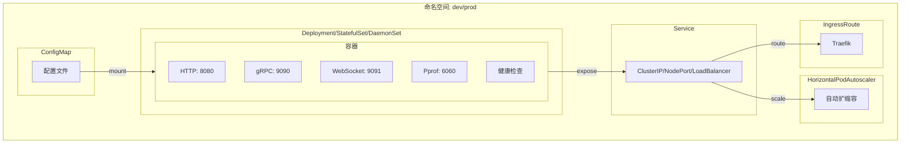
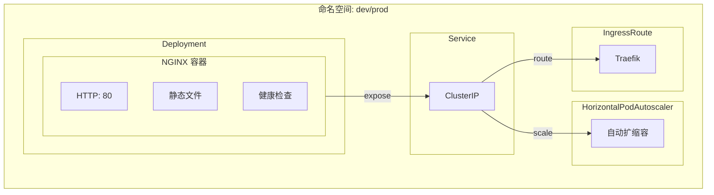
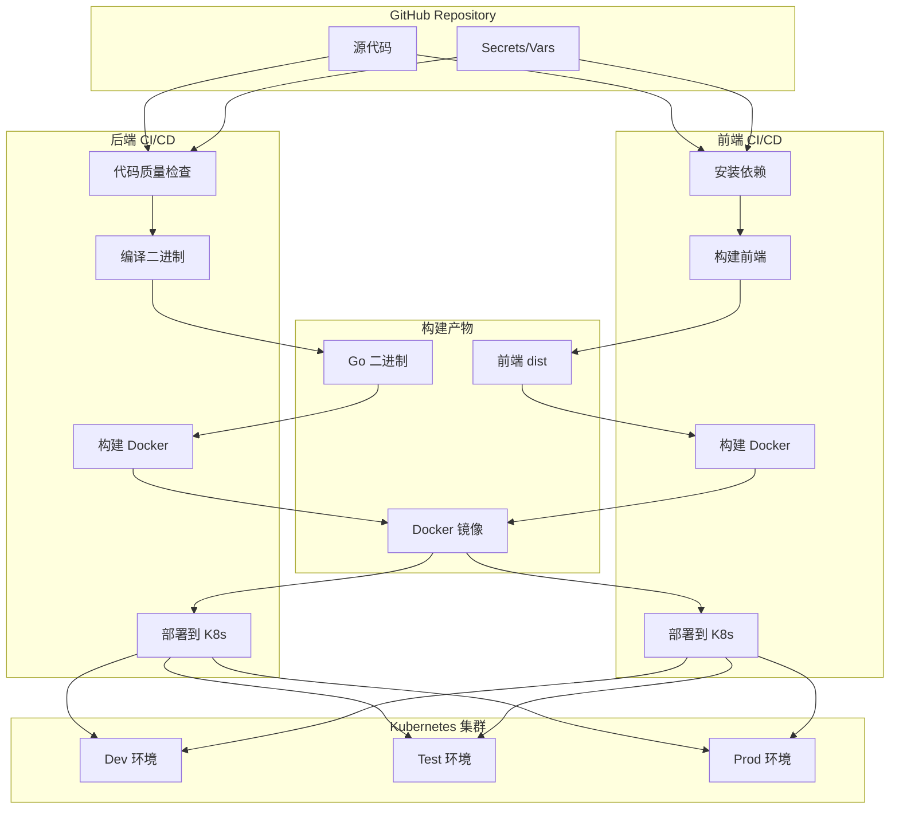

# Deploy Pipeline

可复用的 GitHub Actions 工作流集合，支持 **Go 后端服务** 和 **前端应用** 的完整 CI/CD 流程及 Kubernetes 部署

## 🏗️ 项目架构

```bash
deploy-pipeline/
├── .github/workflows/           # 可复用工作流
│   ├── code-quality.yml         # 代码质量检查
│   ├── cleanup-artifacts.yml   # Artifacts + GHCR 镜像清理
│   ├── backend-build-binary.yml # 编译 Go 二进制文件
│   ├── backend-build-docker.yml # 构建推送后端 Docker 镜像
│   ├── backend-deploy-k8s.yml   # K8s 部署（后端服务）
│   ├── frontend-build-frontend.yml # 前端构建（支持 npm/pnpm/yarn）
│   ├── frontend-build-docker.yml   # 构建推送前端 Docker 镜像
│   └── frontend-deploy-k8s.yml     # K8s 部署（前端应用）
├── scripts/                     # 公共脚本
│   ├── backend/                 # 后端脚本
│   │   └── build-linux.sh       # Go 构建脚本
│   ├── frontend/                # 前端脚本
│   │   └── build-frontend.sh    # 前端构建脚本
│   ├── common.sh                # 通用函数库
│   └── notify.sh                # 飞书/Telegram 通知
├── templates/                   # K8s 资源模板
│   └── k8s/                     # Kubernetes 模板
│       ├── backend/             # 后端服务模板
│       │   ├── deployment.yaml  # Deployment 模板
│       │   ├── service.yaml     # Service 模板
│       │   ├── hpa.yaml         # HPA 模板
│       │   └── ingress.yaml     # IngressRoute 模板
│       └── frontend/            # 前端应用模板
│           ├── deployment.yaml  # Deployment 模板
│           ├── service.yaml     # Service 模板
│           ├── hpa.yaml         # HPA 模板
│           └── ingress.yaml     # IngressRoute 模板
└── README.md                    # 项目文档
```

## 📋 工作流列表

| 分类 | 工作流 | 文件路径 | 说明 |
|------|--------|----------|------|
| **共享** | Code Quality | `code-quality.yml` | 代码格式检查、静态分析、单元测试 |
| **共享** | Cleanup | `cleanup-artifacts.yml` | 清理 Actions artifacts 和 GHCR 旧镜像 |
| **后端** | Build Binary | `backend-build-binary.yml` | 编译 Go 二进制文件（支持 UPX 压缩） |
| **后端** | Build Docker | `backend-build-docker.yml` | 构建并推送后端 Docker 镜像 |
| **后端** | Deploy K8s | `backend-deploy-k8s.yml` | 部署后端服务到 Kubernetes |
| **前端** | Build Frontend | `frontend-build-frontend.yml` | 前端构建（支持 npm/pnpm/yarn） |
| **前端** | Build Docker | `frontend-build-docker.yml` | 构建并推送前端 Docker 镜像 |
| **前端** | Deploy K8s | `frontend-deploy-k8s.yml` | 部署前端应用到 Kubernetes |

> GitHub reusable workflow 的 `uses:` 目标必须直接位于 `.github/workflows/` 顶层，不能放在 `backend/`、`frontend/`、`shared/` 等二级目录。

---

## 🔐 Secrets 和 Variables 配置

### 配置优先级

GitHub Actions 支持**环境级别**和**仓库级别**两种配置方式，优先级为：

```bash
环境级别 (Environment) > 仓库级别 (Repository)
```

当工作流引用 `environment` 时，会优先读取该环境下的 secrets/variables；如果找不到，则回退到仓库级别的配置。

### 🏷️ 所需 Secrets

#### 仓库级别 Secrets（全局共享）

| Secret | 说明 | 用途 | 必填 |
|--------|------|------|------|
| `DOCKER_USERNAME` | Docker/GitHub 用户名 | 镜像推送认证 | ✅ |
| `DOCKER_PASSWORD` | Docker 密码或 GitHub Token | 镜像推送认证 | ✅ |
| `APP_ID` | GitHub App ID | App Token 方式拉取私有 Go 模块 | ❌ |
| `APP_PRIVATE_KEY` | GitHub App 私钥 | App Token 方式拉取私有 Go 模块 | ❌ |
| `GIT_SSH_PRIVATE_KEY` | Git SSH 私钥 (Legacy) | SSH 方式拉取私有 Go 模块 | ❌ |

> **认证方式选择**：推荐使用 `APP_ID` + `APP_PRIVATE_KEY`（GitHub App Token），它会自动生成临时 Token，安全性更高。`GIT_SSH_PRIVATE_KEY` 仍可使用但属于旧方式。

#### 环境级别 Secrets（按环境配置）

| Secret | 说明 | 用途 | 适用环境 |
|--------|------|------|----------|
| `KUBECONFIG` | Kubernetes 集群访问配置 | K8s 部署 | dev/test/prod |
| `FEISHU_WEBHOOK_URL` | 飞书机器人 Webhook | 部署通知 | dev/test/prod |
| `TELEGRAM_BOT_TOKEN` | Telegram Bot Token | 部署通知 | dev/test/prod |
| `TELEGRAM_CHAT_ID` | Telegram 聊天群组 ID | 部署通知 | dev/test/prod |

### 📦 所需 Variables (GitHub Variables)

#### 仓库级别 Variables

| Variable | 说明 | 默认值 | 必填 |
|----------|------|--------|------|
| `GO_VERSION` | 默认 Go 版本 | `1.25.1` | ❌ |
| `GOPROXY` | Go 模块代理地址 | `https://goproxy.cn,direct` | ❌ |
| `GOPRIVATE` | Go 私有模块路径 | `''` | ❌ |
| `GO_AUTH_METHOD` | Go 私有模块认证方式 | `none` | ❌ |
| `NODE_VERSION` | 默认 Node.js 版本 | `20` | ❌ |
| `PACKAGE_REGISTRY` | 默认包管理器仓库 | `https://registry.npmmirror.com` | ❌ |

#### 环境级别 Variables

| Variable | 说明 | 示例值 | 适用环境 |
|----------|------|--------|----------|
| `IMAGE_REGISTRY` | 镜像仓库地址 | `ghcr.io` | dev/test/prod |
| `IMAGE_PREFIX` | 镜像前缀（组织名） | `ghcr.io/your-org` | dev/test/prod |
| `KIND` | Kubernetes workload 类型 | `Deployment` / `StatefulSet` / `DaemonSet` | dev/test/prod |
| `SERVICE_KIND` | Kubernetes Service 类型 | `Service` | dev/test/prod |
| `SERVICE_TYPE` | Kubernetes Service 暴露类型 | `ClusterIP` / `NodePort` / `LoadBalancer` | dev/test/prod |
| `WS_PORT` | WebSocket 端口（可选） | `9090` | dev/test/prod |
| `DEPLOYMENT_REPLICAS` | 默认副本数 | `3` | dev/test/prod |
| `HPA_ENABLED` | 是否启用 HPA | `true` | dev/test/prod |

### 📝 配置示例

#### 仓库级别配置路径

```
Settings > Secrets and variables > Actions > Repository secrets
Settings > Secrets and variables > Actions > Repository variables
```

#### 环境级别配置路径

```
Settings > Environments > [环境名称] > Environment secrets
Settings > Environments > [环境名称] > Environment variables
```

#### 环境配置示例

| 环境名称 | KUBECONFIG | FEISHU_WEBHOOK_URL | DEPLOYMENT_REPLICAS |
|----------|------------|---------------------|---------------------|
| `dev` | dev-cluster-config | <https://open.feishu.cn/>... | `2` |
| `test` | test-cluster-config | <https://open.feishu.cn/>... | `3` |
| `prod` | prod-cluster-config | <https://open.feishu.cn/>... | `5` |

---

## 🚀 快速接入

### 后端 Go 服务示例

在项目 `.github/workflows/pipeline.yml` 中引用：

```yaml
name: Backend CI/CD

on:
  push:
    branches: [main]

jobs:
  code-quality:
    uses: kamalyes/deploy-pipeline/.github/workflows/code-quality.yml@master
    with:
      go-version: ${{ vars.GO_VERSION || '1.25.1' }}
      gotestsum-version: 'v1.13.0'
      goprivate: ${{ vars.GOPRIVATE || '' }}
      go-auth-method: ${{ vars.GO_AUTH_METHOD || 'app-token' }}
    secrets:
      APP_ID: ${{ secrets.APP_ID }}
      APP_PRIVATE_KEY: ${{ secrets.APP_PRIVATE_KEY }}
      GIT_SSH_PRIVATE_KEY: ${{ secrets.GIT_SSH_PRIVATE_KEY }}

  build-binary:
    uses: kamalyes/deploy-pipeline/.github/workflows/backend-build-binary.yml@master
    with:
      go-version: ${{ vars.GO_VERSION || '1.25.1' }}
      binary-name: 'your-service'
      binary-source-dir: 'deployments'
      binary-output: 'deployments/your-service'
      version: '${{ github.sha }}'
      build-time: '${{ format('{0}_{1}', github.event.head_commit.timestamp, github.run_id) }}'
      git-commit: '${{ github.sha }}'
      goprivate: ${{ vars.GOPRIVATE || '' }}
      go-auth-method: ${{ vars.GO_AUTH_METHOD || 'app-token' }}
    secrets:
      APP_ID: ${{ secrets.APP_ID }}
      APP_PRIVATE_KEY: ${{ secrets.APP_PRIVATE_KEY }}
      GIT_SSH_PRIVATE_KEY: ${{ secrets.GIT_SSH_PRIVATE_KEY }}

  build-docker:
    needs: [build-binary]
    uses: kamalyes/deploy-pipeline/.github/workflows/backend-build-docker.yml@master
    with:
      binary-name: 'your-service'
      version: '${{ github.sha }}'
      http-port: '8080'
      rpc-port: '9090'
      ws-port: '9091'        # WebSocket 端口（可选）
      pprof-port: '6060'
      docker-registry: ${{ vars.IMAGE_REGISTRY || 'ghcr.io' }}
      binary-source-dir: 'deployments'
      image-base: '${{ vars.IMAGE_PREFIX }}/your-service'
      image-name: '${{ vars.IMAGE_PREFIX }}/your-service:${{ github.sha }}'
    secrets:
      DOCKER_USERNAME: ${{ secrets.DOCKER_USERNAME }}
      DOCKER_PASSWORD: ${{ secrets.DOCKER_PASSWORD }}

  deploy-dev:
    needs: [build-docker]
    uses: kamalyes/deploy-pipeline/.github/workflows/backend-deploy-k8s.yml@master
    with:
      environment: 'dev'
      image-name: '${{ vars.IMAGE_PREFIX }}/your-service:${{ github.sha }}'
      binary-source-dir: 'deployments'
      binary-name: 'your-service'
      http-port: '8080'
      rpc-port: '9090'
      ws-port: '9091'        # WebSocket 端口（可选）
      pprof-port: '6060'
      notification-provider: 'feishu'
    environment: dev
    secrets:
      KUBECONFIG: ${{ secrets.KUBECONFIG }}
      FEISHU_WEBHOOK_URL: ${{ secrets.FEISHU_WEBHOOK_URL }}
      TELEGRAM_BOT_TOKEN: ${{ secrets.TELEGRAM_BOT_TOKEN }}
      TELEGRAM_CHAT_ID: ${{ secrets.TELEGRAM_CHAT_ID }}
```

### 前端应用示例

```yaml
name: Frontend CI/CD

on:
  push:
    branches: [main]

jobs:
  build-frontend:
    uses: kamalyes/deploy-pipeline/.github/workflows/frontend-build-frontend.yml@master
    with:
      node-version: ${{ vars.NODE_VERSION || '20' }}
      package-manager: 'pnpm'
      package-registry: ${{ vars.PACKAGE_REGISTRY || 'https://registry.npmmirror.com' }}
      version: '${{ github.sha }}'
      build-time: '${{ format('{0}_{1}', github.event.head_commit.timestamp, github.run_id) }}'
      git-commit: '${{ github.sha }}'
      output-dir: 'dist'

  build-docker:
    needs: [build-frontend]
    uses: kamalyes/deploy-pipeline/.github/workflows/frontend-build-docker.yml@master
    with:
      app-name: 'frontend-app'
      version: '${{ github.sha }}'
      http-port: '80'
      docker-registry: ${{ vars.IMAGE_REGISTRY || 'ghcr.io' }}
      image-base: '${{ vars.IMAGE_PREFIX }}/frontend-app'
      image-name: '${{ vars.IMAGE_PREFIX }}/frontend-app:${{ github.sha }}'
      nginx-config-path: 'deploy/nginx.conf'
    secrets:
      DOCKER_USERNAME: ${{ secrets.DOCKER_USERNAME }}
      DOCKER_PASSWORD: ${{ secrets.DOCKER_PASSWORD }}

  deploy-dev:
    needs: [build-docker]
    uses: kamalyes/deploy-pipeline/.github/workflows/frontend-deploy-k8s.yml@master
    with:
      environment: 'dev'
      image-name: '${{ vars.IMAGE_PREFIX }}/frontend-app:${{ github.sha }}'
      app-name: 'frontend-app'
      http-port: '80'
      ingress-path-prefix: '/app'
      notification-provider: 'feishu'
    environment: dev
    secrets:
      KUBECONFIG: ${{ secrets.KUBECONFIG }}
      FEISHU_WEBHOOK_URL: ${{ secrets.FEISHU_WEBHOOK_URL }}
      TELEGRAM_BOT_TOKEN: ${{ secrets.TELEGRAM_BOT_TOKEN }}
      TELEGRAM_CHAT_ID: ${{ secrets.TELEGRAM_CHAT_ID }}
```

### 前端应用示例

```yaml
name: Frontend CI/CD

on:
  push:
    branches: [main]

jobs:
  build-frontend:
    uses: kamalyes/deploy-pipeline/.github/workflows/frontend-build-frontend.yml@master
    with:
      node-version: ${{ vars.NODE_VERSION || '20' }}
      package-manager: 'pnpm'
      package-registry: ${{ vars.PACKAGE_REGISTRY || 'https://registry.npmmirror.com' }}
      version: '${{ github.sha }}'
      build-time: '${{ format('{0}_{1}', github.event.head_commit.timestamp, github.run_id) }}'
      git-commit: '${{ github.sha }}'
      output-dir: 'dist'
    secrets: inherit

  build-docker:
    needs: [build-frontend]
    uses: kamalyes/deploy-pipeline/.github/workflows/frontend-build-docker.yml@master
    with:
      app-name: 'frontend-app'
      version: '${{ github.sha }}'
      http-port: '80'
      docker-registry: ${{ vars.IMAGE_REGISTRY || 'ghcr.io' }}
      image-base: '${{ vars.IMAGE_PREFIX }}/frontend-app'
      image-name: '${{ vars.IMAGE_PREFIX }}/frontend-app:${{ github.sha }}'
      nginx-config-path: 'deploy/nginx.conf'  # 可选：项目自定义 nginx 配置
    secrets: inherit

  deploy-dev:
    needs: [build-docker]
    uses: kamalyes/deploy-pipeline/.github/workflows/frontend-deploy-k8s.yml@master
    with:
      environment: 'dev'
      image-name: '${{ vars.IMAGE_PREFIX }}/frontend-app:${{ github.sha }}'
      app-name: 'frontend-app'
      http-port: '80'
      ingress-path-prefix: '/app'
      notification-provider: 'feishu'
    environment: dev
    secrets: inherit
```

### 前端 Monorepo 示例（pnpm + Turbo）

多应用 monorepo 项目，每个应用独立 CI/CD 工作流：

```yaml
name: 🚀 App A CI/CD

on:
  push:
    branches: [main]
    paths:
      - 'apps/app-a/**'
      - 'packages/**'
      - 'pnpm-lock.yaml'
  workflow_dispatch:
    inputs:
      environment:
        description: '部署环境'
        default: 'dev'
        type: choice
        options: [dev, test, uat, prod]

env:
  NODE_VERSION: '20'
  PNPM_VERSION: '9'
  IMAGE_PREFIX: 'ghcr.io/${{ github.repository }}'

jobs:
  build:
    uses: kamalyes/deploy-pipeline/.github/workflows/frontend-build-frontend.yml@master
    with:
      node-version: ${{ env.NODE_VERSION }}
      pnpm-version: ${{ env.PNPM_VERSION }}
      package-manager: 'pnpm'
      build-command: 'pnpm run build:app-a'
      output-dir: 'apps/app-a/dist'
      artifact-name: 'app-a-dist'
      version: '${{ github.sha }}'
      build-time: '${{ format("{0}_{1}", github.event.head_commit.timestamp, github.run_id) }}'
      git-commit: '${{ github.sha }}'

  docker:
    needs: [build]
    uses: kamalyes/deploy-pipeline/.github/workflows/frontend-build-docker.yml@master
    with:
      app-name: 'my-project-app-a'
      version: '${{ github.sha }}'
      docker-registry: 'ghcr.io'
      image-base: '${{ env.IMAGE_PREFIX }}/my-project-app-a'
      image-name: '${{ env.IMAGE_PREFIX }}/my-project-app-a:${{ github.sha }}'
      build-output-dir: 'apps/app-a/dist'
      artifact-name: 'app-a-dist'
      nginx-config-path: 'deploy/nginx.conf'
    secrets:
      DOCKER_USERNAME: ${{ secrets.DOCKER_USERNAME }}
      DOCKER_PASSWORD: ${{ secrets.DOCKER_PASSWORD }}

  deploy:
    needs: [docker]
    uses: kamalyes/deploy-pipeline/.github/workflows/frontend-deploy-k8s.yml@master
    with:
      environment: ${{ inputs.environment || 'dev' }}
      image-name: '${{ env.IMAGE_PREFIX }}/my-project-app-a:${{ github.sha }}'
      app-name: 'my-project-app-a'
      http-port: '80'
      ingress-path-prefix: '/app-a'
      notification-provider: 'feishu'
    environment: ${{ inputs.environment || 'dev' }}
    secrets:
      KUBECONFIG: ${{ secrets.KUBECONFIG }}
      FEISHU_WEBHOOK_URL: ${{ secrets.FEISHU_WEBHOOK_URL }}
      TELEGRAM_BOT_TOKEN: ${{ secrets.TELEGRAM_BOT_TOKEN }}
      TELEGRAM_CHAT_ID: ${{ secrets.TELEGRAM_CHAT_ID }}
```

---

## 📖 工作流详细说明

### 共享工作流

#### Code Quality

代码质量检查：gofmt + go vet + 单元测试 + 覆盖率报告

| 参数 | 类型 | 必填 | 默认值 | 说明 |
|------|------|------|--------|------|
| `go-version` | string | 否 | `1.25.1` | Go 版本 |
| `gotestsum-version` | string | 否 | `v1.13.0` | gotestsum 版本 |
| `goproxy` | string | 否 | `https://goproxy.cn,direct` | Go 模块代理 |
| `goprivate` | string | 否 | `''` | 私有模块路径 |
| `go-auth-method` | string | 否 | `none` | 私有模块认证方式（同 Build Binary） |
| `retention-days` | string | 否 | `7` | 构建产物保留天数 |

**所需 Secrets（当 `goprivate` 非空时）：**

| Secret | 认证方式 | 说明 |
|--------|----------|------|
| `APP_ID` | `app-token` | GitHub App ID |
| `APP_PRIVATE_KEY` | `app-token` | GitHub App 私钥 |
| `GIT_SSH_PRIVATE_KEY` | `ssh` | SSH 私钥（Legacy） |

#### Cleanup

清理 Actions artifacts 和 GHCR 旧版本镜像，支持独立开关和按保留天数/版本数清理

**Artifacts 清理参数：**

| 参数 | 类型 | 必填 | 默认值 | 说明 |
|------|------|------|--------|------|
| `cleanup-artifacts` | boolean | 否 | `true` | 是否清理 Actions artifacts |
| `keep-days` | string | 否 | `7` | 保留最近 N 天的 artifacts |

**GHCR 镜像清理参数：**

| 参数 | 类型 | 必填 | 默认值 | 说明 |
|------|------|------|--------|------|
| `cleanup-images` | boolean | 否 | `false` | 是否清理 GHCR 镜像 |
| `project-owner` | string | 否 | `''` | GitHub 组织/用户名（cleanup-images 为 true 时必填） |
| `image-name` | string | 否 | `''` | 镜像名（逗号分隔多个，留空则自动扫描所有 container packages） |
| `keep-count` | string | 否 | `5` | 保留镜像版本数 |

**调用示例：**

```yaml
# 只清理 artifacts
cleanup:
  uses: kamalyes/deploy-pipeline/.github/workflows/cleanup-artifacts.yml@master
  with:
    cleanup-artifacts: true
    keep-days: '7'

# 同时清理 artifacts + 指定镜像
cleanup:
  uses: kamalyes/deploy-pipeline/.github/workflows/cleanup-artifacts.yml@master
  with:
    cleanup-artifacts: true
    keep-days: '7'
    cleanup-images: true
    project-owner: 'your-org'
    image-name: 'your-service'
    keep-count: '5'

# 扫描清理所有镜像（image-name 留空）
cleanup:
  uses: kamalyes/deploy-pipeline/.github/workflows/cleanup-artifacts.yml@master
  with:
    cleanup-images: true
    project-owner: 'your-org'
    image-name: ''
    keep-count: '5'

# 清理多个指定镜像（逗号分隔）
cleanup:
  uses: kamalyes/deploy-pipeline/.github/workflows/cleanup-artifacts.yml@master
  with:
    cleanup-images: true
    project-owner: 'your-org'
    image-name: 'tenant-admin,ops-admin'
    keep-count: '5'
```

### 后端工作流

#### Build Binary

编译 Go 二进制文件，支持交叉编译和 UPX 压缩

| 参数 | 类型 | 必填 | 默认值 | 说明 |
|------|------|------|--------|------|
| `go-version` | string | 是 | - | Go 版本 |
| `binary-name` | string | 是 | - | 二进制文件名 |
| `binary-source-dir` | string | 是 | - | 二进制输出目录 |
| `binary-output` | string | 是 | - | 二进制完整输出路径 |
| `version` | string | 是 | - | 版本号 |
| `build-time` | string | 是 | - | 构建时间 |
| `git-commit` | string | 是 | - | Git commit hash |
| `goproxy` | string | 否 | `https://goproxy.cn,direct` | Go 模块代理 |
| `goprivate` | string | 否 | `''` | 私有模块路径（如 `github.com/your-org/*`） |
| `go-auth-method` | string | 否 | `none` | 私有模块认证方式，详见下方说明 |
| `os` | string | 否 | `linux` | 目标操作系统 |
| `arch` | string | 否 | `amd64` | 目标架构 |
| `upx-compress` | string | 否 | `false` | 是否启用 UPX 压缩 |
| `retention-days` | string | 否 | `7` | 构建产物保留天数 |

**所需 Secrets：**

| Secret | 认证方式 | 说明 |
|--------|----------|------|
| `APP_ID` | `app-token` | GitHub App ID |
| `APP_PRIVATE_KEY` | `app-token` | GitHub App 私钥 |
| `GIT_SSH_PRIVATE_KEY` | `ssh` | SSH 私钥（Legacy） |

---

#### 🔐 Go 私有模块认证（`go-auth-method`）

当项目依赖私有 Go 模块（通过 `goprivate` 指定）时，CI 需要认证才能拉取。`go-auth-method` 支持三种方式：

| 值 | 说明 | Secrets | 安全性 |
|-----|------|---------|--------|
| `app-token` | **推荐** — 使用 GitHub App 动态生成短期 Token | `APP_ID` + `APP_PRIVATE_KEY` | ⭐⭐⭐ Token 自动过期，权限可细粒度控制 |
| `ssh` | 传统方式 — 使用 SSH 私钥拉取 | `GIT_SSH_PRIVATE_KEY` | ⭐⭐ 私钥长期有效，需手动轮换 |
| `none` | 不需要认证（公开仓库或已有其他认证） | 无 | — |

**优先级链：** `input > vars.GO_AUTH_METHOD > 'none'`

**`app-token` 方式工作原理：**

1. 使用 `actions/create-github-app-token@v1` 由 `APP_ID` + `APP_PRIVATE_KEY` 生成临时 Token
2. 自动配置 `git config --global url."https://x-access-token:<token>@github.com/".insteadOf "https://github.com/"`
3. Token 仅在当前 Job 生命周期内有效，Job 结束自动失效

**GitHub App 配置步骤：**

1. 前往 GitHub → Settings → Developer settings → GitHub Apps → New GitHub App
2. 设置 Permissions：Contents → Read-only（拉取私有仓库）
3. 安装 App 到目标组织/仓库
4. 将 App ID 存入仓库 Secret `APP_ID`
5. 将 App 生成的 Private Key 存入仓库 Secret `APP_PRIVATE_KEY`

**`ssh` 方式工作原理：**

1. 使用 `webfactory/ssh-agent@v0.9.0` 加载 SSH 私钥
2. 配置 `git config --global url."git@github.com:".insteadOf "https://github.com/"`
3. 私钥永不过期，需定期手动轮换

**调用示例：**

```yaml
# 推荐：App Token 方式
build-binary:
  uses: kamalyes/deploy-pipeline/.github/workflows/backend-build-binary.yml@master
  with:
    binary-name: 'my-service'
    goprivate: 'github.com/my-org/*'
    go-auth-method: 'app-token'
  secrets:
    APP_ID: ${{ secrets.APP_ID }}
    APP_PRIVATE_KEY: ${{ secrets.APP_PRIVATE_KEY }}

# Legacy：SSH 方式
build-binary:
  uses: kamalyes/deploy-pipeline/.github/workflows/backend-build-binary.yml@master
  with:
    binary-name: 'my-service'
    goprivate: 'github.com/my-org/*'
    go-auth-method: 'ssh'
  secrets:
    GIT_SSH_PRIVATE_KEY: ${{ secrets.GIT_SSH_PRIVATE_KEY }}
```

#### Build Docker (Backend)

构建后端 Docker 镜像并推送到镜像仓库

| 参数 | 类型 | 必填 | 默认值 | 说明 |
|------|------|------|--------|------|
| `binary-name` | string | 是 | - | 二进制文件名 |
| `version` | string | 是 | - | 版本号 |
| `http-port` | string | 是 | - | HTTP 端口 |
| `rpc-port` | string | 是 | - | gRPC 端口 |
| `ws-port` | string | 否 | `''` | WebSocket 端口（可选） |
| `ws-deployment-mode` | string | 否 | `combined` | WebSocket 部署模式：combined（混合）或 separate（独立） |
| `ws-app-name` | string | 否 | `${binary-name}-ws` | WebSocket 独立部署的应用名称 |
| `pprof-port` | string | 是 | - | Pprof 端口 |
| `docker-registry` | string | 是 | - | 镜像仓库地址 |
| `binary-source-dir` | string | 是 | - | 二进制文件目录 |
| `image-base` | string | 是 | - | 基础镜像名（不带 tag） |
| `image-name` | string | 是 | - | 完整镜像名（带 tag） |

**所需 Secrets：**

| Secret | 必填 | 说明 |
|--------|------|------|
| `DOCKER_USERNAME` | 否 | 镜像仓库用户名，默认 `github.actor` |
| `DOCKER_PASSWORD` | 否 | 镜像仓库密码/Token，默认 `GITHUB_TOKEN` |

#### Deploy K8s (Backend)

部署后端服务到 Kubernetes 集群

| 参数 | 类型 | 必填 | 默认值 | 说明 |
|------|------|------|--------|------|
| `environment` | string | 是 | - | 部署环境（用作 K8s namespace） |
| `image-name` | string | 是 | - | 完整镜像名（带 tag） |
| `binary-name` | string | 是 | - | 服务名 |
| `kind` | string | 否 | `Deployment` | Kubernetes workload 类型：Deployment/StatefulSet/DaemonSet |
| `service-kind` | string | 否 | `Service` | Kubernetes Service kind 类型 |
| `service-type` | string | 否 | `ClusterIP` | Kubernetes Service 暴露类型：ClusterIP/NodePort/LoadBalancer |
| `http-port` | string | 是 | - | HTTP 端口 |
| `rpc-port` | string | 是 | - | gRPC 端口 |
| `ws-port` | string | 否 | `''` | WebSocket 端口（可选） |
| `pprof-port` | string | 是 | - | Pprof 端口 |
| `config-yaml` | string | 否 | `''` | 配置文件路径 |
| `configmap-name` | string | 否 | `''` | ConfigMap 名称 |
| `enable-hpa` | string | 否 | `true` | 是否启用 HPA |
| `ingress-path-prefix` | string | 否 | `''` | Ingress 路径前缀 |
| `notification-provider` | string | 否 | `none` | 通知方式 |

**所需环境级 Secrets：**

| Secret | 必填 | 说明 |
|--------|------|------|
| `KUBECONFIG` | 是 | K8s 集群配置 |
| `FEISHU_WEBHOOK_URL` | 否 | 飞书通知 Webhook URL |
| `TELEGRAM_BOT_TOKEN` | 否 | Telegram Bot Token |
| `TELEGRAM_CHAT_ID` | 否 | Telegram 聊天群组 ID |

### 前端工作流

#### Build Frontend

前端构建，支持 npm、pnpm、yarn 三种包管理器

| 参数 | 类型 | 必填 | 默认值 | 说明 |
|------|------|------|--------|------|
| `node-version` | string | 是 | - | Node.js 版本 |
| `version` | string | 是 | - | 构建版本号 |
| `build-time` | string | 是 | - | 构建时间戳 |
| `git-commit` | string | 是 | - | Git commit hash |
| `package-manager` | string | 否 | `npm` | 包管理器：npm/pnpm/yarn |
| `package-registry` | string | 否 | `https://registry.npmmirror.com` | 包管理器仓库地址 |
| `build-command` | string | 否 | `npm run build` | 构建命令（monorepo 可传 `pnpm run build:xxx`） |
| `output-dir` | string | 否 | `dist` | 构建输出目录 |
| `artifact-name` | string | 否 | `frontend-dist` | 构建产物 Artifact 名称（多应用并行构建时需区分） |
| `pnpm-version` | string | 否 | `8` | pnpm 版本（仅 package-manager 为 pnpm 时生效） |
| `retention-days` | string | 否 | `7` | 构建产物保留天数 |

#### Build Docker (Frontend)

构建前端 Docker 镜像（基于 Nginx）

| 参数 | 类型 | 必填 | 默认值 | 说明 |
|------|------|------|--------|------|
| `app-name` | string | 是 | - | 前端应用名称 |
| `version` | string | 是 | - | 版本号 |
| `http-port` | string | 否 | `80` | HTTP 端口 |
| `docker-registry` | string | 是 | - | 镜像仓库地址 |
| `image-base` | string | 是 | - | 基础镜像名（不带 tag） |
| `image-name` | string | 是 | - | 完整镜像名（带 tag） |
| `base-image` | string | 否 | `nginx:1.25.3-alpine` | 基础 Nginx 镜像 |
| `nginx-config-path` | string | 否 | `''` | 项目自定义 nginx.conf 路径 |
| `artifact-name` | string | 否 | `frontend-dist` | 构建产物 Artifact 名称（需与 build-frontend 一致） |

#### Deploy K8s (Frontend)

部署前端应用到 Kubernetes 集群

| 参数 | 类型 | 必填 | 默认值 | 说明 |
|------|------|------|--------|------|
| `environment` | string | 是 | - | 部署环境（用作 K8s namespace） |
| `image-name` | string | 是 | - | 完整镜像名（带 tag） |
| `app-name` | string | 是 | - | 应用名称 |
| `http-port` | string | 否 | `80` | HTTP 端口 |
| `ingress-path-prefix` | string | 否 | `''` | Ingress 路径前缀 |
| `enable-hpa` | string | 否 | `true` | 是否启用 HPA |
| `notification-provider` | string | 否 | `none` | 通知方式 |

**所需 Secrets：**

| Secret | 必填 | 说明 |
|--------|------|------|
| `DOCKER_USERNAME` | 否 | 镜像仓库用户名，默认 `github.actor` |
| `DOCKER_PASSWORD` | 否 | 镜像仓库密码/Token，默认 `GITHUB_TOKEN` |

#### Deploy K8s (Frontend)

部署前端应用到 Kubernetes 集群

| 参数 | 类型 | 必填 | 默认值 | 说明 |
|------|------|------|--------|------|
| `environment` | string | 是 | - | 部署环境（用作 K8s namespace） |
| `image-name` | string | 是 | - | 完整镜像名（带 tag） |
| `app-name` | string | 是 | - | 应用名称 |
| `http-port` | string | 否 | `80` | HTTP 端口 |
| `ingress-path-prefix` | string | 否 | `''` | Ingress 路径前缀 |
| `enable-hpa` | string | 否 | `true` | 是否启用 HPA |
| `notification-provider` | string | 否 | `none` | 通知方式 |

**所需环境级 Secrets：**

| Secret | 必填 | 说明 |
|--------|------|------|
| `KUBECONFIG` | 是 | K8s 集群配置 |
| `FEISHU_WEBHOOK_URL` | 否 | 飞书通知 Webhook URL |
| `TELEGRAM_BOT_TOKEN` | 否 | Telegram Bot Token |
| `TELEGRAM_CHAT_ID` | 否 | Telegram 聊天群组 ID |

---

## 📊 K8s 部署架构

### 后端服务架构



### 前端应用架构



### CI/CD 流程图



---

## 📜 公共脚本

### backend/build-linux.sh

Go 二进制构建脚本

```bash
bash scripts/backend/build-linux.sh \
  --version "v1.0.0" \
  --build-time "2026-01-01_00:00:00" \
  --git-commit "abc12356" \
  --binary-name "your-service" \
  --output-dir "deployments" \
  --os linux --arch amd64 \
  --upx-compress false
```

### frontend/build-frontend.sh

前端构建脚本，支持多种包管理器

```bash
bash scripts/frontend/build-frontend.sh \
  --version "v1.0.0" \
  --build-time "2026-01-01_00:00:00" \
  --git-commit "abc12356" \
  --node-version "20" \
  --package-manager "pnpm" \
  --package-registry "https://registry.npmmirror.com" \
  --output-dir "dist"
```

### notify.sh

通用通知脚本，支持飞书和 Telegram

```bash
export NOTIFICATION_PROVIDER=feishu  # feishu | telegram | all | none
export NOTIFICATION_TYPE=deployment  # deployment | rollback
export STATUS=success                # success | failure
export ENVIRONMENT=dev
export BINARY_NAME=your-service
export WORKFLOW_URL=https://github.com/...
export FEISHU_WEBHOOK_URL=https://open.feishu.cn/...
bash scripts/notify.sh
```

---

## 🔄 工作流脚本引用机制

公共 workflow 通过 `actions/checkout` 额外检出本仓库来获取脚本：

- **backend-build-binary.yml**: 优先使用项目自带 `scripts/backend/build-linux.sh`，不存在则使用公共仓库的
- **frontend-build-frontend.yml**: 优先使用项目自带 `scripts/frontend/build-frontend.sh`，不存在则使用公共仓库的
- **frontend-build-docker.yml**: 优先使用项目自定义 `nginx.conf`，不存在则使用默认配置
- **backend-deploy-k8s.yml / frontend-deploy-k8s.yml**: 通知功能使用公共仓库的 `scripts/notify.sh`

---

## ✅ 自测清单

### 后端工作流测试

| 步骤 | 检查项 | 状态 |
|------|--------|------|
| 1 | Code Quality 工作流可运行 | ✅ |
| 2 | Build Binary 工作流可运行 | ✅ |
| 3 | Build Docker 工作流可运行 | ✅ |
| 4 | Deploy K8s 工作流可运行 | ✅ |

### 前端工作流测试

| 步骤 | 检查项 | 状态 |
|------|--------|------|
| 1 | Build Frontend 支持 npm | ✅ |
| 2 | Build Frontend 支持 pnpm | ✅ |
| 3 | Build Frontend 支持 yarn | ✅ |
| 4 | Build Docker 支持自定义 nginx.conf | ✅ |
| 5 | Deploy K8s 工作流可运行 | ✅ |

### 模板测试

| 步骤 | 检查项 | 状态 |
|------|--------|------|
| 1 | backend/deployment.yaml 模板完整 | ✅ |
| 2 | backend/service.yaml 模板完整 | ✅ |
| 3 | backend/hpa.yaml 模板完整 | ✅ |
| 4 | backend/ingress.yaml 模板完整 | ✅ |
| 5 | frontend/deployment.yaml 模板完整 | ✅ |
| 6 | frontend/service.yaml 模板完整 | ✅ |
| 7 | frontend/hpa.yaml 模板完整 | ✅ |
| 8 | frontend/ingress.yaml 模板完整 | ✅ |
